# Open5GS Practice

## Installation and Configuration and demonstration

ICT Innovation Square

2024 Digital New Technology Course 2nd Session \- Network Course

2024\-09\-02 Lee\, Sanghoon

<span style="color:#222222"> __Open5GS \+ UERANSIM 5G __ </span>  <span style="color:#222222"> __Network__ </span>  <span style="color:#222222"> __ __ </span>  <span style="color:#222222"> __Overview__ </span>

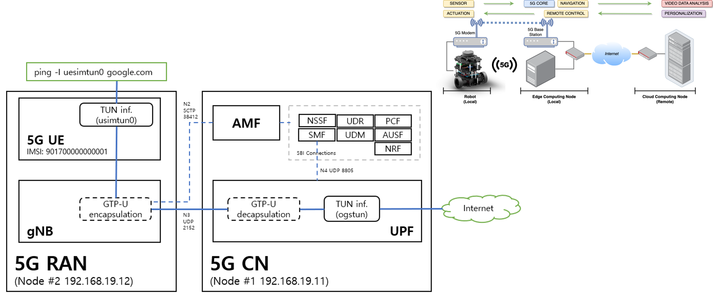

## Network Configuration

Network mode : NAT \+ Host\-Only Network

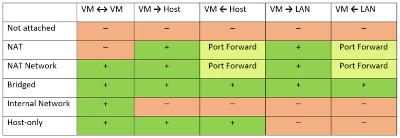

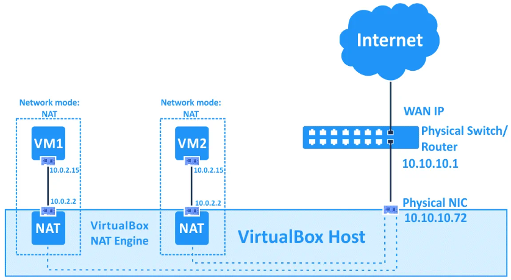

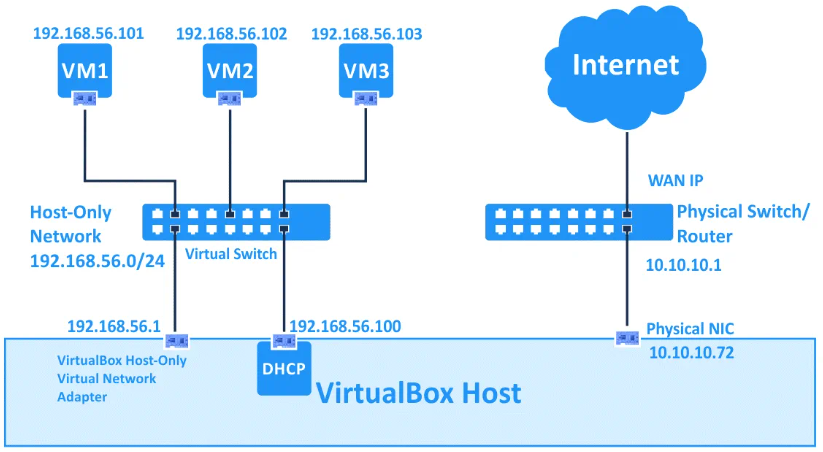

## <span style="color:#222222"> __Ubuntu pre\-installed VM image download__ </span>


### 1 Download Ubuntu 20\.04 VM image for Node\#1 and Node\#2 :
  * <span style="color:#222222">Download from : </span>  <span style="color:#222222">[https://www\.linuxvmimages\.com/images/ubuntu\-2004/\#ubuntu\-20044](https://www.linuxvmimages.com/images/ubuntu-2004/#ubuntu-20044)</span>  <span style="color:#222222"> </span>
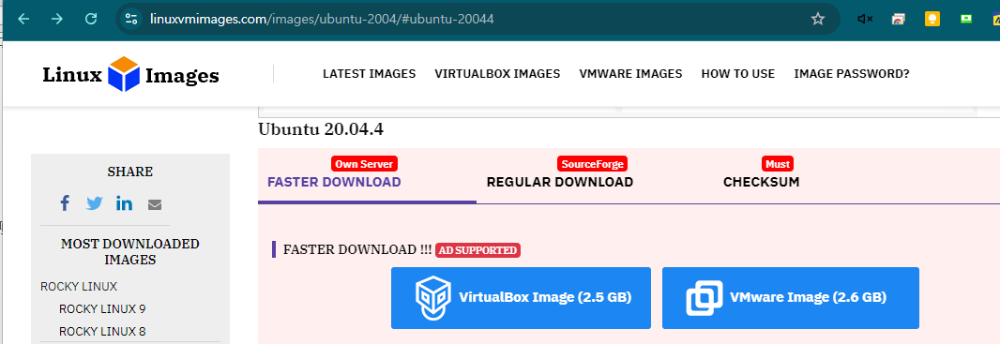

### 2 <span style="color:#222222">Open the image in VM tool and clone it to node1 and node2</span>

### 3 <span style="color:#222222">Create Host only network with 192\.168\.19\.1/24</span>
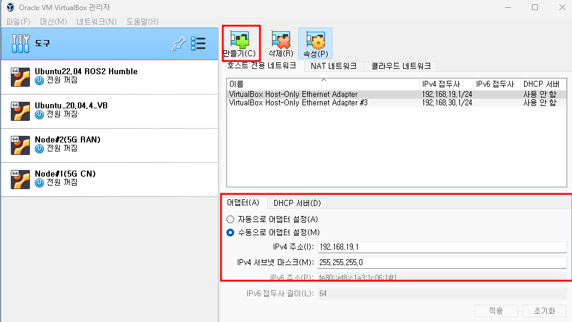

### 4 <span style="color:#222222">Select the VM and click Setting tab and select adapter2 and select host only network which is created previous\.</span>
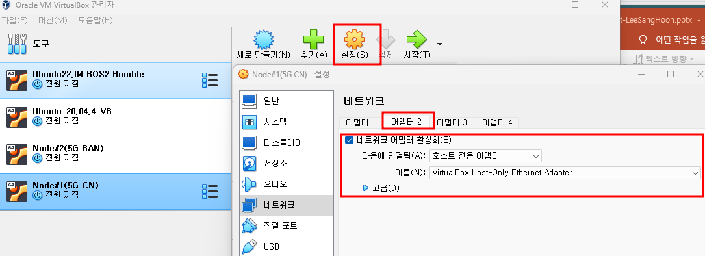

### 5 <span style="color:#222222">Run the node VM and set the IP of host only network interface</span>


```bash
cd /etc/netplan
sudo vi 01-network-manager-all.yaml:
add ethernets config (ex, for node1)
--------
ethernets:
 enp0s3:
  dhcp4: true
 enp0s8:
  dhcp4: false
  addresses: [192.168.19.11/24]
--------
sudo netplan apply
** for checking, run "Ifconfig"
```

## <span style="color:#222222"> __node\#1\(5G CN\) \- __ </span>  <span style="color:#222222"> __Open5GS Installation__ </span>

### <span style="color:#222222">Node\#1: Ubuntu 20\.04:</span>

#### 1. <span style="color:#222222">Install Open5GS with a Package Manager</span>

#### - <span style="color:#222222">mongodb</span>  <span style="color:#222222"> Installation:</span>
```bash
sudo apt-get install gnupg curl

curl -fsSL https://www.mongodb.org/static/pgp/server-6.0.asc | sudo gpg -o /usr/share/keyrings/mongodb-server-6.0.gpg    --dearmor

echo "deb [ arch=amd64,arm64 signed-by=/usr/share/keyrings/mongodb-server-6.0.gpg ] https://repo.mongodb.org/apt/ubuntu focal/mongodb-org/6.0 multiverse" | sudo tee /etc/apt/sources.list.d/mongodb-org-6.0.list

sudo apt-get update
sudo apt-get install -y mongodb-org=6.0.17 mongodb-org-database=6.0.17 mongodb-org-server=6.0.17 mongodb-org-mongos=6.0.17 mongodb-org-tools=6.0.17

sudo systemctl start mongod
```
#### - open5gs Installation:
```bash
sudo add-apt-repository ppa:open5gs/latest
sudo apt update
sudo apt install –y open5gs
```

#### 2. <span style="color:#222222">Install the </span>  <span style="color:#222222">WebUI</span>  <span style="color:#222222"> of Open5GS</span>

#### - <span style="color:#222222">Node\.js Installation:</span>
``` bash
# Download and import the Nodesource GPG key
sudo apt update
sudo apt install -y ca-certificates curl gnupg

sudo mkdir -p /etc/apt/keyrings
curl -fsSL https://deb.nodesource.com/gpgkey/nodesource-repo.gpg.key | sudo gpg --dearmor -o /etc/apt/keyrings/nodesource.gpg

# Create deb repository
NODE_MAJOR=20
echo "deb [signed-by=/etc/apt/keyrings/nodesource.gpg] https://deb.nodesource.com/node_$NODE_MAJOR.x nodistro main" | sudo tee /etc/apt/sources.list.d/nodesource.list

# Run Update and Install
sudo apt update
sudo apt install nodejs -y
```
#### - Install WebUI:
``` bash
curl -fsSL https://open5gs.org/open5gs/assets/webui/install | sudo -E bash -
```
#### - <span style="color:#222222">Routing setting:</span>
``` bash
sudo sysctl -w net.ipv4.ip_forward=1
sudo sysctl -w net.ipv6.conf.all.forwarding=1

sudo iptables -t nat -A POSTROUTING -s 10.45.0.0/16 ! -o ogstun -j MASQUERADE
sudo ip6tables -t nat -A POSTROUTING -s 2001:230:cafe::/48 ! -o ogstun -j MASQUERADE
```
#### 3. <span style="color:#222222">Configure Open5GS</span>
>  <span style="color:#222222">Out of the box\, the default configurations see all of the Open5GS components </span>
  <span style="color:#222222">fully configured for use on a single computer\. </span>
  <span style="color:#222222">They are set to communicate with each other using the local loopback address space \(127\.0\.0\.X\)\.</span>
  <span style="color:#222222">If needed:</span>
>>    <span style="color:#222222">Setup a 4G/ 5G NSA Core</span>
    <span style="color:#222222">Setup a 5G Core</span>
    <span style="color:#222222">Configure logging</span>

#### - <span style="color:#222222"> Register Subscriber Information:</span>
> Connect to http://localhost:9999 and login with admin account.
>> Username : admin
Password : 1423
 
 > To add subscriber information, you can do WebUI operations in the following order:
>> ① Go to Subscriber Menu.
② Click + Button to add a new subscriber.
③ Fill the IMSI, ->  999700000000001  => test imsi # in the default config
④ security context(K, OPc, AMF), and APN of the subscriber. => no need to change
⑤ Click SAVE Button

#### - UPF config:
``` bash
sudo vi /etc/open5gs/upf.yaml:
  --------
  upf:
    gtpu:
      - addr: 192.168.19.11
  --------
sudo systemctl restart open5gs-upfd
```
#### - AMF config:
``` bash
sudo vi /etc/open5gs/amf.yaml:
--------
amf:
    ngap:
      - addr: 192.168.19.11
--------
sudo systemctl restart open5gs-amfd
```

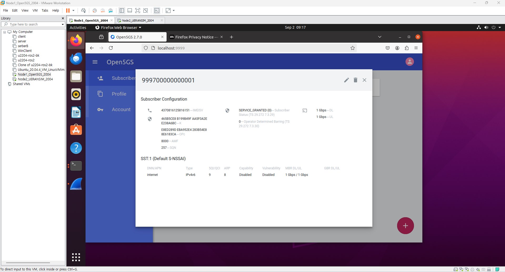

## <span style="color:#222222"> __node\#2\(5G RAN\) \- __ </span>  <span style="color:#222222"> __UERANSIM Installation__ </span>

### <span style="color:#222222">Node\#2: Ubuntu 20\.04:</span>

#### 1. <span style="color:#222222">Install UERANSIM</span>
``` bash
# install git
sudo apt update  
sudo apt upgrade  
sudo apt install git -y  

# cloning ueransim source  
cd ~  
git clone https://github.com/aligungr/UERANSIM
​
# install dev tools  
sudo apt install make -y  
sudo apt install gcc -y  
sudo apt install g++ -y  
sudo apt install libsctp-dev lksctp-tools -y  
sudo apt install iproute2 -y  
sudo snap install cmake --classic  

#​ build  
cd ~/UERANSIM  
make -j2
```

#### 2. <span style="color:#222222">Config UERANSIM</span>
#### - gNodeB setting
vi ~/UERANSIM/config/open5gs-gnb.yaml:
``` bash
--------
linkIp: 127.0.0.1   # gNB's local IP address for Radio Link Simulation (Usually same with local IP)
ngapIp: 192.168.19.12   # gNB's local IP address for N2 Interface (Usually same with local IP)
gtpIp: 192.168.19.12    # gNB's local IP address for N3 Interface (Usually same with local IP)

# List of AMF address information
amfConfigs:
  - address: 192.168.19.11
    port: 38412
--------
```

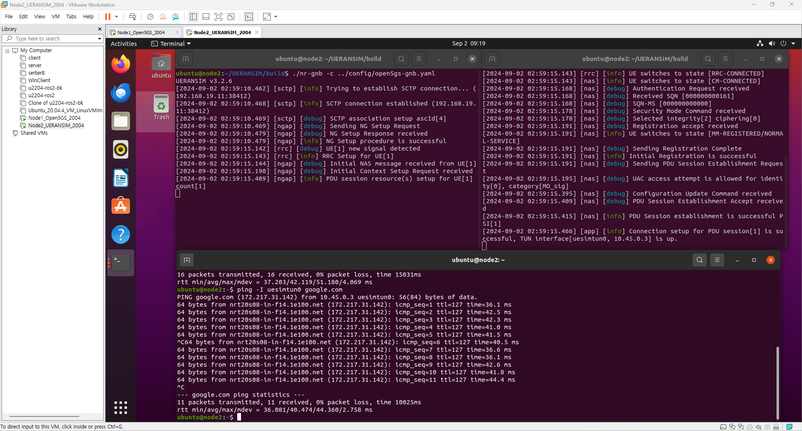

## Test Running
### <span style="color:#222222">Node\#1: Open5GS</span>

#### 1. <span style="color:#222222">Check whether Open5GS nodes are running:</span>
``` bash
ps \-ef | grep open5gs
open5gs   179656       1  0 04:22 ?        00:01:24 /usr/bin/open5gs\-pcrfd \-c /etc/open5gs/pcrf\.yaml
open5gs   179824       1  0 04:22 ?        00:00:06 /usr/bin/open5gs\-pcfd \-c /etc/open5gs/pcf\.yaml
open5gs   179888       1  0 04:22 ?        00:00:31 /usr/bin/open5gs\-nrfd \-c /etc/open5gs/nrf\.yaml
open5gs   180063       1  0 04:22 ?        00:00:06 /usr/bin/open5gs\-udrd \-c /etc/open5gs/udr\.yaml
open5gs   180165       1  0 04:22 ?        00:01:16 /usr/bin/open5gs\-hssd \-c /etc/open5gs/hss\.yaml
open5gs   180267       1  0 04:22 ?        00:00:06 /usr/bin/open5gs\-bsfd \-c /etc/open5gs/bsf\.yaml
open5gs   180331       1  0 04:22 ?        00:01:12 /usr/bin/open5gs\-scpd \-c /etc/open5gs/scp\.yaml
open5gs   180395       1  0 04:22 ?        00:01:36 /usr/bin/open5gs\-smfd \-c /etc/open5gs/smf\.yaml
open5gs   180501       1  0 04:22 ?        00:00:20 /usr/bin/open5gs\-seppd \-c /etc/open5gs/sepp1\.yaml
open5gs   180565       1  0 04:22 ?        00:00:04 /usr/bin/open5gs\-sgwud \-c /etc/open5gs/sgwu\.yaml
open5gs   180629       1  0 04:22 ?        00:00:06 /usr/bin/open5gs\-ausfd \-c /etc/open5gs/ausf\.yaml
open5gs   180692       1  0 04:22 ?        00:01:26 /usr/bin/open5gs\-mmed \-c /etc/open5gs/mme\.yaml
open5gs   180798       1  0 04:22 ?        00:00:04 /usr/bin/open5gs\-sgwcd \-c /etc/open5gs/sgwc\.yaml
open5gs   180861       1  0 04:22 ?        00:00:06 /usr/bin/open5gs\-nssfd \-c /etc/open5gs/nssf\.yaml
open5gs   180924       1  0 04:22 ?        00:00:06 /usr/bin/open5gs\-udmd \-c /etc/open5gs/udm\.yaml
open5gs   184779       1  0 05:25 ?        00:00:04 /usr/bin/open5gs\-upfd \-c /etc/open5gs/upf\.yaml
open5gs   184805       1  0 05:26 ?        00:00:06 /usr/bin/open5gs\-amfd \-c /etc/open5gs/amf\.yaml
```


#### 2.  <span style="color:#222222">Test Subscriber registration at Node\#1: Open5GS</span>
  * <span style="color:#222222">Run the browser \(node\#1 local default browser: </span>  <span style="color:#222222">firefox</span>  <span style="color:#222222">\)</span>
  * <span style="color:#222222">Enter the url: </span>  <span style="color:#222222">htttp://localhost:9999</span>
  * <span style="color:#222222">Login w</span>  <span style="color:#222222">ith </span>  <span style="color:#222222">Username: admin / Password: 1423</span>
  * <span style="color:#222222">Add Subscriber with IMSI \# as 999700000000001</span>
    > <span style="color:#222222"> Default test </span>  <span style="color:#222222">imsi</span>  <span style="color:#222222"> number</span>

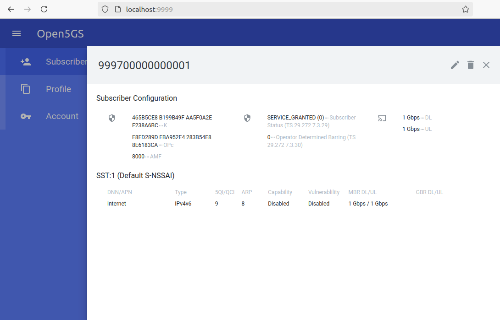

### Node#2: USERANSIM

#### 1. Run gNodeB:
``` bash
cd ~/UERANSIM/build
./nr-gnb -c ../config/open5gs-gnb.yaml
```
#### 2. Run UE:
``` bash
cd ~/UERANSIM/build  
sudo ./nr-ue -c ../config/open5gs-ue.yaml
```
#### 3. Run UE:
``` bash
ping -I uesimtun0 google.com
```
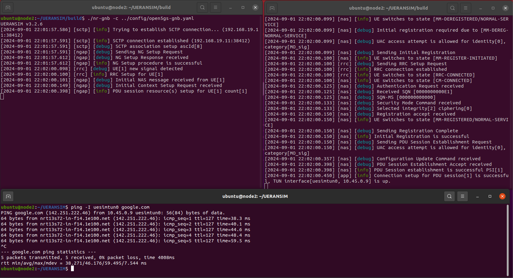

## <span style="color:#222222"> __Run Wireshark on the node\#1\, Capture for any__ </span>
### <span style="color:#222222">Node\#1: </span>  
<span style="color:#222222">wireshark</span>  <span style="color:#222222">: filter </span>  <span style="color:#222222">ip\.addr</span>  <span style="color:#222222"> == 192\.168\.19\.12 => Node\#2</span>

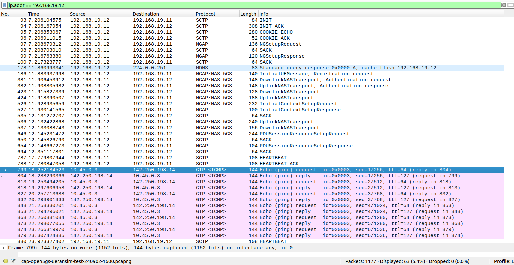
